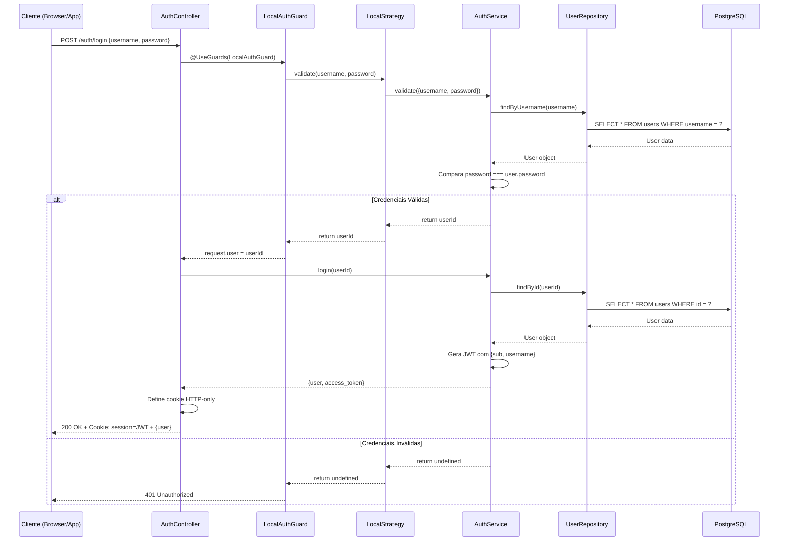
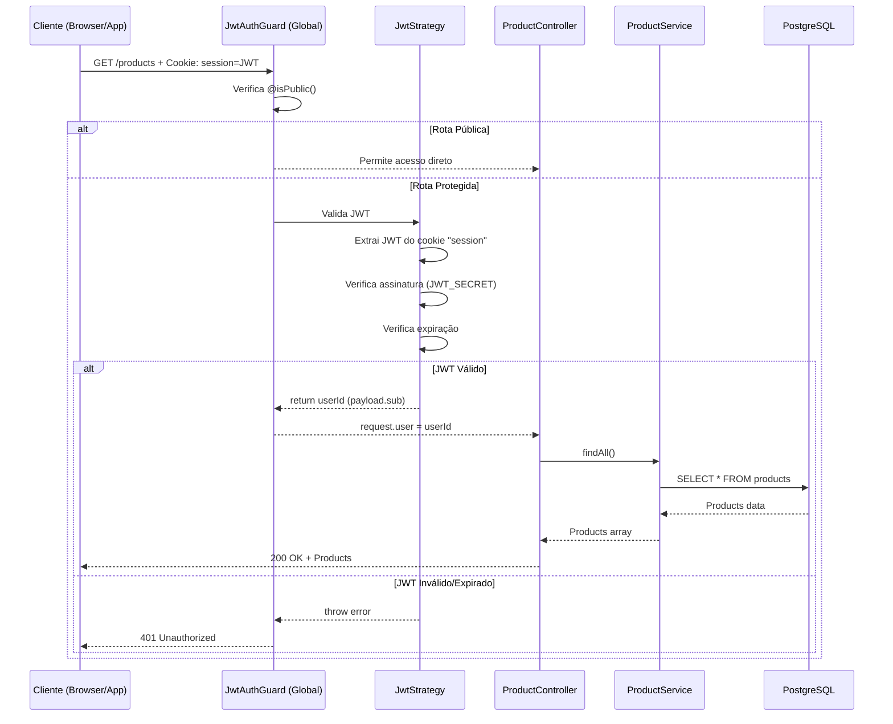

# Diagramas de Fluxo de Autenticação - Constrular System

## 📊 Fluxo Completo de Login



## 🔒 Fluxo de Requisição Protegida



## 🔑 Estrutura do JWT

```
┌────────────────────────────────────────────────────────────┐
│                      JWT Token                              │
├────────────────────────────────────────────────────────────┤
│                                                             │
│  Header (Base64)                                            │
│  {                                                          │
│    "alg": "HS256",                                          │
│    "typ": "JWT"                                             │
│  }                                                          │
│                                                             │
│  ─────────────────────────────────────────────────────────  │
│                                                             │
│  Payload (Base64)                                           │
│  {                                                          │
│    "sub": 1,              ← userId                          │
│    "username": "admin",   ← nome de usuário                 │
│    "iat": 1699123456,     ← issued at                       │
│    "exp": 1701715456      ← expires (30 dias)               │
│  }                                                          │
│                                                             │
│  ─────────────────────────────────────────────────────────  │
│                                                             │
│  Signature (HMAC SHA256)                                    │
│  HMACSHA256(                                                │
│    base64UrlEncode(header) + "." +                          │
│    base64UrlEncode(payload),                                │
│    JWT_SECRET                                               │
│  )                                                          │
│                                                             │
└────────────────────────────────────────────────────────────┘
```

## 🍪 Anatomia do Cookie de Sessão

```
┌────────────────────────────────────────────────────────────┐
│                  Cookie: session                            │
├────────────────────────────────────────────────────────────┤
│                                                             │
│  Nome:     session                                          │
│  Valor:    eyJhbGciOiJIUzI1NiIsInR5cCI6IkpXVCJ9...        │
│  Path:     /                                                │
│  Domain:   localhost                                        │
│  Expires:  30 dias                                          │
│                                                             │
│  ┌─────────────────────────────────────────────────────┐   │
│  │ Flags de Segurança:                                 │   │
│  ├─────────────────────────────────────────────────────┤   │
│  │  ✓ HttpOnly   → JS não pode acessar                 │   │
│  │  ✓ Secure     → Apenas HTTPS                        │   │
│  │  ✓ SameSite   → Previne CSRF                        │   │
│  └─────────────────────────────────────────────────────┘   │
│                                                             │
└────────────────────────────────────────────────────────────┘
```

## 🎭 Sistema de Proteção de Rotas

```
┌─────────────────────────────────────────────────────────────┐
│                   AppModule (app.module.ts)                  │
├─────────────────────────────────────────────────────────────┤
│                                                              │
│  providers: [                                                │
│    {                                                         │
│      provide: APP_GUARD,                                     │
│      useClass: JwtAuthGuard ← Guard Global                   │
│    }                                                         │
│  ]                                                           │
│                                                              │
└────────────────┬────────────────────────────────────────────┘
                 │
                 │ Aplica a TODAS as rotas
                 │
                 ▼
┌─────────────────────────────────────────────────────────────┐
│                    Requisição Recebida                       │
└─────────────────────────────────────────────────────────────┘
                 │
                 ▼
┌─────────────────────────────────────────────────────────────┐
│              JwtAuthGuard.canActivate()                      │
│                                                              │
│  1. Verifica @isPublic() no controller/method                │
│     ├─ Se TRUE → Permite acesso (pula JWT)                   │
│     └─ Se FALSE → Continua validação                         │
│                                                              │
│  2. Extrai JWT do cookie "session"                           │
│  3. Valida JWT (assinatura + expiração)                      │
│  4. Extrai userId do payload                                 │
│  5. Injeta em request.user                                   │
│                                                              │
└────────────────┬────────────────────────────────────────────┘
                 │
                 ▼
┌─────────────────────────────────────────────────────────────┐
│                   Controller Method                          │
│                                                              │
│  @Get('products')                                            │
│  async getProducts(@CurrentUserId() userId: number) {        │
│    // userId disponível aqui                                 │
│  }                                                           │
│                                                              │
└─────────────────────────────────────────────────────────────┘
```

## 👥 Fluxo de Múltiplos Tipos de Usuários (RBAC)

```
┌─────────────────────────────────────────────────────────────┐
│                   Requisição Autenticada                     │
│                   (userId em request.user)                   │
└────────────────┬────────────────────────────────────────────┘
                 │
                 ▼
┌─────────────────────────────────────────────────────────────┐
│              JwtAuthGuard (APP_GUARD #1)                     │
│  ✓ Valida JWT                                                │
│  ✓ Injeta userId em request.user                             │
└────────────────┬────────────────────────────────────────────┘
                 │
                 ▼
┌─────────────────────────────────────────────────────────────┐
│              RolesGuard (APP_GUARD #2)                       │
│                                                              │
│  1. Extrai roles requeridas do decorator @Roles()            │
│     Exemplo: @Roles('ADMINISTRATOR', 'MANAGER')              │
│                                                              │
│  2. Se não há @Roles() → Permite acesso                      │
│                                                              │
│  3. Busca usuário no banco via userId                        │
│                                                              │
│  4. Verifica se user.role está na lista de roles             │
│     ├─ Se SIM → Permite acesso                               │
│     └─ Se NÃO → 403 Forbidden                                │
│                                                              │
└────────────────┬────────────────────────────────────────────┘
                 │
                 ▼
┌─────────────────────────────────────────────────────────────┐
│                   Controller Method                          │
│                                                              │
│  @Delete('products/:id')                                     │
│  @Roles('ADMINISTRATOR')                                     │
│  async deleteProduct(@Param('id') id: string) {              │
│    // Só ADMINISTRATOR pode executar                         │
│  }                                                           │
│                                                              │
└─────────────────────────────────────────────────────────────┘
```

## 🔐 Matriz de Controle de Acesso

```
┌────────────────────┬──────────────┬─────────┬────────┬──────────┐
│      Recurso       │ ADMINISTRATOR│ MANAGER │ SELLER │ CUSTOMER │
├────────────────────┼──────────────┼─────────┼────────┼──────────┤
│ Gerenciar Usuários │      ✓       │    ✗    │   ✗    │    ✗     │
│ Ver Relatórios     │      ✓       │    ✓    │   ✗    │    ✗     │
│ Criar Produtos     │      ✓       │    ✓    │   ✗    │    ✗     │
│ Editar Produtos    │      ✓       │    ✓    │   ✗    │    ✗     │
│ Deletar Produtos   │      ✓       │    ✗    │   ✗    │    ✗     │
│ Ver Produtos       │      ✓       │    ✓    │   ✓    │    ✓     │
│ Criar Pedidos      │      ✓       │    ✓    │   ✓    │    ✗     │
│ Ver Todos Pedidos  │      ✓       │    ✓    │   ✓    │    ✗     │
│ Ver Meus Pedidos   │      ✓       │    ✓    │   ✓    │    ✓     │
│ Atualizar Perfil   │      ✓       │    ✓    │   ✓    │    ✓     │
└────────────────────┴──────────────┴─────────┴────────┴──────────┘
```

## 🛡️ Camadas de Segurança

```
┌─────────────────────────────────────────────────────────────┐
│                    Cliente (Browser)                         │
└────────────────┬────────────────────────────────────────────┘
                 │
                 │ HTTPS (TLS/SSL)
                 │
                 ▼
┌─────────────────────────────────────────────────────────────┐
│                CORS + Cookies Seguros                        │
│  • origin: whitelist                                         │
│  • credentials: true                                         │
│  • HttpOnly cookies                                          │
└────────────────┬────────────────────────────────────────────┘
                 │
                 ▼
┌─────────────────────────────────────────────────────────────┐
│              Rate Limiting (Throttler)                       │
│  • 10 requisições/minuto                                     │
│  • 5 tentativas de login/minuto                              │
└────────────────┬────────────────────────────────────────────┘
                 │
                 ▼
┌─────────────────────────────────────────────────────────────┐
│            Validation Pipe (class-validator)                 │
│  • Valida DTOs                                               │
│  • Sanitiza inputs                                           │
│  • Previne SQL Injection                                     │
└────────────────┬────────────────────────────────────────────┘
                 │
                 ▼
┌─────────────────────────────────────────────────────────────┐
│                  JwtAuthGuard (Global)                       │
│  • Valida JWT                                                │
│  • Verifica expiração                                        │
│  • Extrai userId                                             │
└────────────────┬────────────────────────────────────────────┘
                 │
                 ▼
┌─────────────────────────────────────────────────────────────┐
│                   RolesGuard (Opcional)                      │
│  • Verifica permissões                                       │
│  • Controla acesso por role                                  │
└────────────────┬────────────────────────────────────────────┘
                 │
                 ▼
┌─────────────────────────────────────────────────────────────┐
│                 Business Logic (Service)                     │
│  • bcrypt para senhas                                        │
│  • Prisma ORM (previne SQL Injection)                        │
│  • Validações de negócio                                     │
└────────────────┬────────────────────────────────────────────┘
                 │
                 ▼
┌─────────────────────────────────────────────────────────────┐
│                    PostgreSQL Database                       │
│  • Credenciais seguras                                       │
│  • Backups regulares                                         │
└─────────────────────────────────────────────────────────────┘
```

## 📋 Checklist de Segurança

```
Autenticação
  ✓ JWT com expiração
  ✓ Cookies HTTP-only
  ✓ Cookies Secure (HTTPS)
  ✓ SameSite cookies
  ✗ Hash de senhas (bcrypt) ← IMPLEMENTAR
  ✗ Refresh tokens ← RECOMENDADO
  
Autorização
  ✓ Guard global (JwtAuthGuard)
  ✓ Sistema de roles
  ✗ RolesGuard implementado ← IMPLEMENTAR
  ✗ Controle de propriedade ← IMPLEMENTAR

Proteção de Dados
  ✓ Validation Pipe global
  ✓ DTOs com class-validator
  ✓ Prisma ORM
  ✗ Sanitização de inputs ← REVISAR
  
Rede
  ✓ CORS configurado
  ✓ HTTPS em produção
  ✗ Rate limiting ← IMPLEMENTAR
  ✗ Helmet.js ← RECOMENDADO
  
Monitoramento
  ✗ Logs de auditoria ← IMPLEMENTAR
  ✗ Alertas de segurança ← IMPLEMENTAR
  ✗ Métricas de acesso ← IMPLEMENTAR
```

## 🔄 Fluxo de Logout

```mermaid
sequenceDiagram
    participant Client as Cliente
    participant Controller as AuthController
    participant Browser as Browser Storage

    Client->>Controller: POST /auth/logout + Cookie: session=JWT
    Controller->>Controller: clearCookie('session')
    Controller-->>Client: 200 OK + Set-Cookie: session=; Max-Age=0
    Client->>Browser: Remove cookie "session"
    Browser-->>Client: Cookie removido
    
    Note over Client,Browser: Próxima requisição protegida resultará em 401
```

---

**Nota:** Estes diagramas ilustram o funcionamento atual do sistema Constrular. Para implementação em um novo sistema, consulte `AUTHENTICATION_GUIDE.md` para código completo e detalhado.
